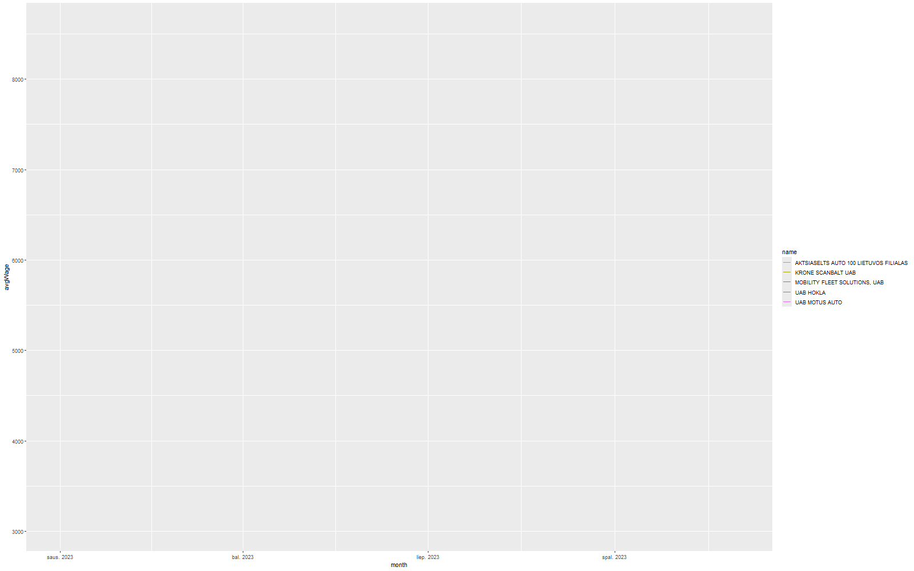
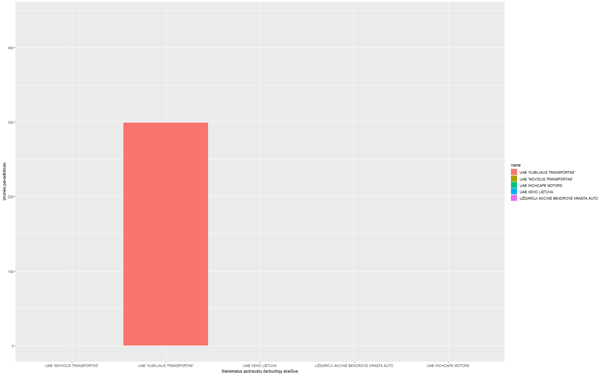

# R Laboratorinis darbas: duomenų vizualizacija

|Variantas | ecoActCode|Formatas          |
|:---------|----------:|:-----------------|
|9         |     451100|https://atvira.sodra.lt/imones/downloads/2023/monthly-2023.csv.zip|

### 2.1 Užduotis

Atsakymas:

Išvados: Įmonių vidutinio atlyginimo kiekių lentelė pagal kodą.

### 2.2 Užduotis

Atsakymas:

Išvados: Top penkių įmonių išmokami atlyginimai yra metu pradzioje panašus tačiau antrojoje metu dalyje atlygimai labai svyruoja tiek aukštyn, tiek žemyn.

### 2.3 Užduotis

Atsakymas:

Išvados: Apdraustuju darbuotoju skaičius top penkiose įmonėse labai mažai skiriasi, išskyrus pati pirma įmonė kurios išmokami atlyginimai beveik dvigubai didesni už kitų.

### 3. Užduotis

Shiny R aplikacijos nuotrauka:

